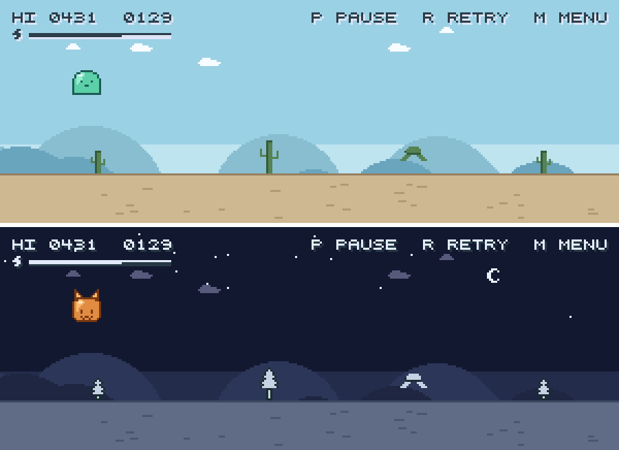

# rabbithole

 \~\~\~ 摸鱼小游戏 \~\~\~ 等待 AI agent 工作时轻松一下 :)

**Games for slacking off.** Something to do while waiting for your AI agent :)

推荐玩下面这款 **[mochi-dash](mochi-dash/README.md)**：比小恐龙丰富一丢丢的色彩和手感。不同角色、不同场景，
难度完全没有区别 —— 选什么完全只看我心情！没有复杂的玩法，也没有终点。摸鱼时拒绝压力！

[浏览器也可以玩](https://lydiazly.github.io/rabbithole/)
[](https://lydiazly.github.io/rabbithole/)

_其他小游戏只是凑数的..._

_我太懒了不想写双语了，反正都是 AI 写..._

_反正代码也是 vibe coding 的..._

## Playing

Each game is a self-contained [uv](https://docs.astral.sh/uv/) project in its own
directory. `play` finds them, so nothing needs listing anywhere:

```sh
./play             # pick from a menu
./play mochi-dash  # start one directly
```

`R` plays again and `Q` quits, in all of them.

| game | | |
|---|---|---|
| [mochi-dash](mochi-dash/README.md) | a window | endless runner, jump and duck |
| [snake](snake/README.md) | terminal | eat, grow, don't bite yourself |
| [breakout](breakout/README.md) | terminal | clear the bricks, three lives |

## Playing without a checkout

The terminal games are pure standard library, so there is nothing to install:

```sh
uvx --from "git+https://github.com/lydiazly/rabbithole#subdirectory=mochi-dash" mochi-dash
```

Mochi Dash plays in the browser at the link above, built by
`.github/workflows/pages.yml` on every push to `main` (Pages source: GitHub
Actions). It carries no assets, so the download is small; the CPython and pygame
runtime comes from the pygame-web CDN at load time.

## Adding a game

Drop in a subdirectory with a `pyproject.toml` that declares a
`[project.scripts]` entry, and `play` picks it up with no edit. A game that draws
in a window says so, and is then started in the background so the terminal comes
straight back:

```toml
[tool.rabbithole]
launch = "windowed"
```

The default is the terminal, which is the screen for the curses games: they hold
it until they exit, because detaching one from its tty kills it. A backgrounded
game's output goes to `~/Library/Logs/rabbithole/` on macOS and
`$XDG_STATE_HOME/rabbithole/` (usually `~/.local/state`) elsewhere.

## Letting Claude Code tell you when to play

The point of the whole thing is the wait, so Claude Code can
run the game for you: it nudges you when a turn is taking a while, and pauses the
game the moment your attention is wanted back.

Three hooks in `~/.claude/settings.json`, each pointing at a small script in
`~/.claude/hooks/`:

| hook | when it fires | what it does |
|---|---|---|
| `UserPromptSubmit` | you send a prompt | starts a 30-second timer, then says "still working — go play" |
| `Stop` | Claude finishes | cancels the timer; pauses the game if it has focus |
| `Notification` | Claude wants you | same, so a permission prompt is never left behind a game |

```json
{
  "hooks": {
    "UserPromptSubmit": [
      { "hooks": [{ "type": "command", "command": "~/.claude/hooks/mochi-turn-watch", "timeout": 5 }] }
    ],
    "Stop": [
      { "hooks": [{ "type": "command", "command": "~/.claude/hooks/mochi-turn-done", "timeout": 5 }] }
    ],
    "Notification": [
      { "hooks": [{ "type": "command", "command": "~/.claude/hooks/mochi-turn-done", "timeout": 5 }] }
    ]
  }
}
```

Three things make it behave rather than get in the way:

- **The timer runs detached.** Claude Code reads a hook's output until every
  holder of the pipe is gone, so a plain background job would stall the turn for
  the whole 30 seconds — the exact opposite of the point. `setsid` with stdout
  closed is what keeps the turn moving.
- **The pause is a toggle, so it is only ever sent to a focused game.** `P`
  sent blind would just as happily unpause a game paused on purpose, and taking
  focus from someone who is already working would be worse than staying quiet.
- **Every failure is silent.** No display, no `xdotool`, driving it over SSH from
  another machine — each just means one of the two channels (desktop
  notification, tmux status line) is the live one. A convenience hook must never
  be able to break a session.
