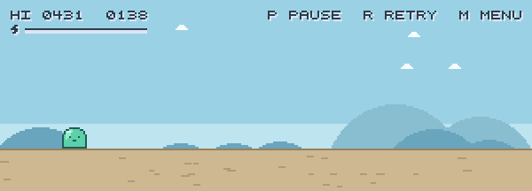
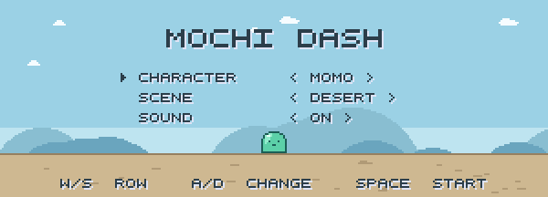
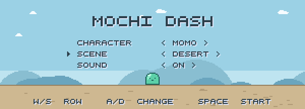
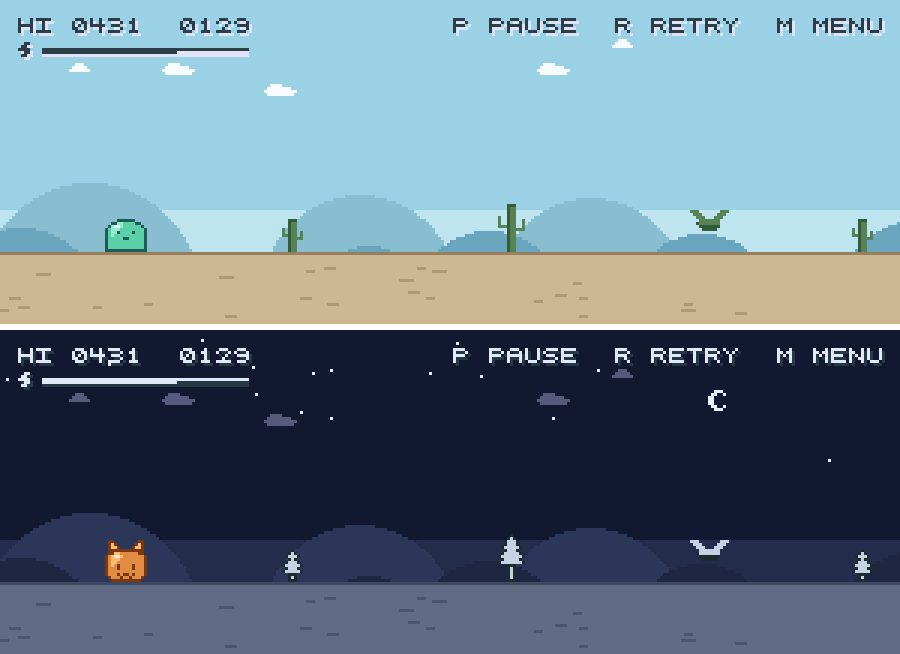

# mochi-dash

An endless runner in a window, named for how the characters move. Part of
[rabbithole](../README.md).



Play it in a browser with nothing to install:
<https://lydiazly.github.io/rabbithole/>

Or from a checkout:

```sh
../play mochi-dash     # or ./play mochi-dash from the repository root
```

| pick a character | pick a place |
|---|---|
|  |  |

Momo the slime, Coco the cat, Jojo the bird and Bobo the shiba, in a desert or a
snowfield. Neither choice changes the difficulty — every character collides
through the same box whatever shape its face is — so picking is a matter of mood.



## Controls

`space` or `W` jumps, and again in mid-air for a second jump worth about half as
much height on top. The timing is forgiving and the arc flattens at the top, so
clearing something is not a matter of one frame. `S` flattens you under low
flyers. `A`/`D` shift where you stand, further back buying reaction time.

`P` pauses — clicking away from the window pauses too, though coming back does
not un-pause, so you land where you left off. `M` reopens the menu, which is also
where the sound is switched off. `R` plays again, `Q` quits. The browser build
binds no quit key: a page cannot close a tab it did not open. Close the tab
instead.

Mouse and touch work too. Left button jumps and right button ducks, held for a
higher jump the same way the keys are. On a touchscreen, press the sky to jump
and the character or the ground to duck. The hotkey line along the top is a row
of buttons, so pause, retry and the menu are reachable without a keyboard.

## The run

It opens easy — nothing but single cacti while you find the jump — and adds
taller ones, clusters and flyers as it speeds up, spacing them tighter as it
goes. Scoring pays for what an obstacle asked of you: a point for a cactus and
two for a tall one, two for a flyer low enough to duck, nothing at all for one
that sails past overhead.

Points earn a **dash**: a few seconds of running much faster and flattening
whatever is in the way instead of dying to it. It warns you before it goes, thins
the traffic out as it does, then leaves the screen empty for three seconds,
counting down, so you can find your footing again. Each one costs more than the
last, so they stay a reward rather than a rhythm.

Your best run is saved, to `%APPDATA%\Mochi Dash` on Windows,
`~/Library/Application Support/Mochi Dash` on macOS and
`$XDG_DATA_HOME/mochi-dash` (usually `~/.local/share`) on Linux — localStorage in
the browser.

## Development

```sh
uv run pytest -q          # no window needed; SDL runs headless

# Re-record the animations above, straight from the game
uv run --with pillow python tools/record.py ../media
```

Nothing in `media/` is hand-captured: `tools/record.py` drives the real `Game`
with scripted input and a seeded RNG, so the same command twice gives the same
bytes, and a recolour or a retune is one command away from matching media.

`web/` holds the three pieces the browser build needs beyond the game itself: the
favicon, drawn from the same sprite code the window's icon is, and the page's
stylesheet and its one script, injected into what pygbag builds.
`.github/workflows/pages.yml` runs the suite first, so a red test stops the
deploy.
